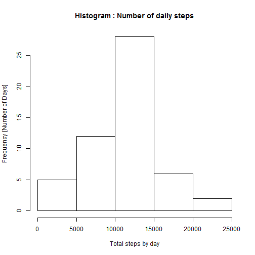
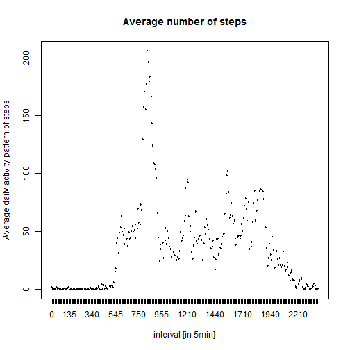
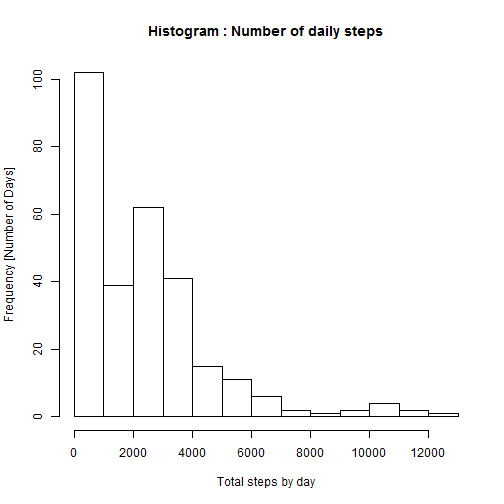
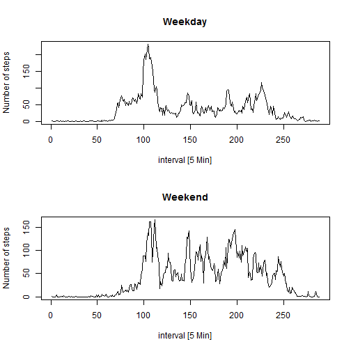

##Introduction

It is now possible to collect a large amount of data about personal movement using activity monitoring devices such as a Fitbit, Nike Fuelband, or Jawbone Up. These type of devices are part of the "quantified self" movement - a group of enthusiasts who take measurements about themselves regularly to improve their health, to find patterns in their behavior, or because they are tech geeks. But these data remain under-utilized both because the raw data are hard to obtain and there is a lack of statistical methods and software for processing and interpreting the data.

This assignment makes use of data from a personal activity monitoring device. This device collects data at 5 minute intervals through out the day. The data consists of two months of data from an anonymous individual collected during the months of October and November, 2012 and include the number of steps taken in 5 minute intervals each day.


###Loading and preprocessing the data

Here I shall set my working directory and load in the data


```r
setwd("C:/Users/sarahruthlang/Documents/R/RR_PeerAssessment1")
activityDataSet <- read.csv('activity.csv')
```

###What is mean total number of steps taken per day?

The following code snippet aggregates the total number of steps taken by day


```r
stepsbyday <- aggregate(steps~date,activityDataSet,sum)
```

Rather than generating a large table I have created a histogram, the code and output of this can be seen below:


```r
hist(stepsbyday$steps, xlab="Total steps by day", ylab="Frequency [Number of Days]",main="Histogram : Number of daily steps")
```

 

Ignoring the missing values, the mean and the median total steps per day are as follows:


```r
mean(stepsbyday$steps, na.rm=TRUE)
```

```
## [1] 10766.19
```


```r
median(stepsbyday$steps, na.rm=TRUE)
```

```
## [1] 10765
```


##What is the average daily activity pattern?

The average number of steps is averaged across all days


```r
activityDataSet$interval <- as.factor(activityDataSet$interval)
aggregatedDataSetInterval <- aggregate(steps~interval,activityDataSet,mean)
```

and now plotted


```r
plot(aggregatedDataSetInterval, type="l", xlab="interval [in 5min]", ylab="Average daily activity pattern of steps",  main="Average number of steps")
```

 

The 5 minute interval with the highest averaged volume of steps is


```r
aggregatedDataSetInterval$interval[which.max(aggregatedDataSetInterval$steps)]
```

```
## [1] 835
## 288 Levels: 0 5 10 15 20 25 30 35 40 45 50 55 100 105 110 115 120 ... 2355
```

###Imputing missing values

The total number of rows with missing values are demonstrated below


```r
sum(is.na(activityDataSet$steps))
```

```
## [1] 2304
```

The presence of missing days may introduce bias into some calculations or summaries of the data. To overcome this I shall impute the missing data with the mean for the interval.


```r
activityDataSetNAadjusted = merge(activityDataSet, aggregatedDataSetInterval, by="interval")

activityDataSetNAadjusted$steps.x[is.na(activityDataSetNAadjusted$steps.x)] = activityDataSetNAadjusted$steps.y[is.na(activityDataSetNAadjusted$steps.x)]
```

Taking these differences into account I shall now recalculate the research undertaken above. The average total number of steps taken by day is now calculated by 


```r
aggregatedDataSetNAadjusted <- aggregate(steps.x~interval,activityDataSetNAadjusted,sum)
```

And the historgram is slightly different


```r
hist(aggregatedDataSetNAadjusted$steps.x, xlab="Total steps by day", ylab="Frequency [Number of Days]",main="Histogram : Number of daily steps")
```

 

The median and mean are calculated below:


```r
mean(aggregatedDataSetNAadjusted$steps)
```

```
## [1] 2280.339
```


```r
median(aggregatedDataSetNAadjusted$steps)
```

```
## [1] 2080.906
```

Comparing these to the results above there are some big differences. the method of imputing, and indeed the act of imputing, has heavily skewed the data making the distribution less normal. The median and mode values have decreased significantly.


###Are there differences in activity patterns between weekdays and weekends?

In order to examine this I will need to create factor variables to demonstrate which observations are in the week and which are on the weekend.


```r
activityDataSetNAadjusted$day <- as.POSIXlt(activityDataSetNAadjusted$date)$wday
activityDataSetNAadjusted$day[activityDataSetNAadjusted$day %in% c(0, 6) ] <- "Weekend"
activityDataSetNAadjusted$day[activityDataSetNAadjusted$day %in% c(1:5) ] <- "Weekday"
```

The averages are calculated below:


```r
averageStepsByIntervalWeekday =  tapply(subset(activityDataSetNAadjusted, day=="Weekday")$steps.x, subset(activityDataSetNAadjusted, day=="Weekday")$interval, mean)
averageStepsByIntervalWeekend =  tapply(subset(activityDataSetNAadjusted, day=="Weekend")$steps.x, subset(activityDataSetNAadjusted, day=="Weekend")$interval, mean)
```

And plotted below:


```r
par(mfrow = c(2, 1))
plot(averageStepsByIntervalWeekday, type="l", xlab="interval [5 Min]", ylab="Number of steps", main="Weekday")
plot(averageStepsByIntervalWeekend, type="l", xlab="interval [5 Min]", ylab="Number of steps", main="Weekend")
```

 
